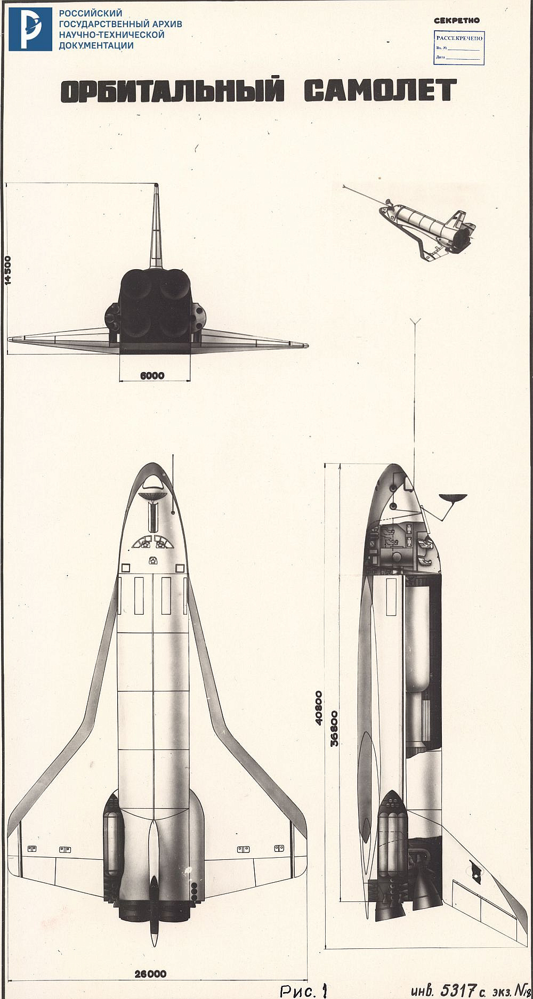
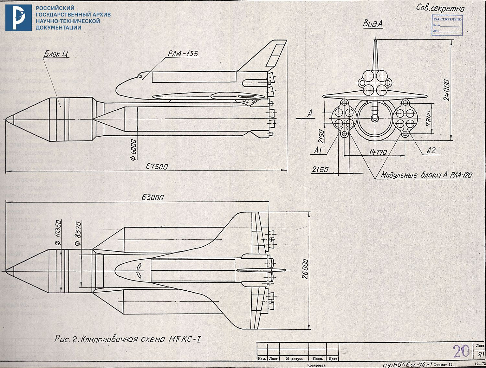
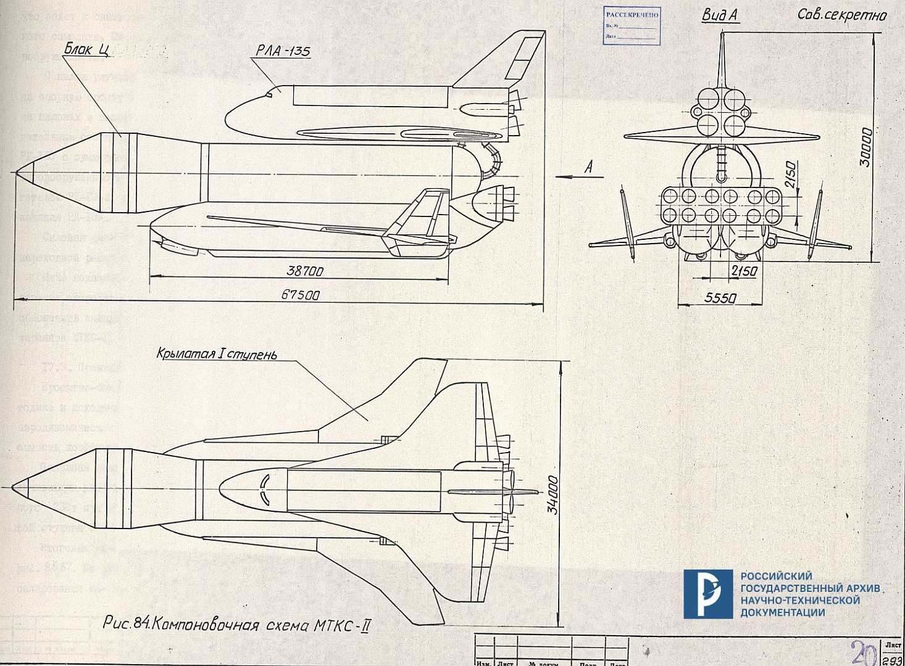
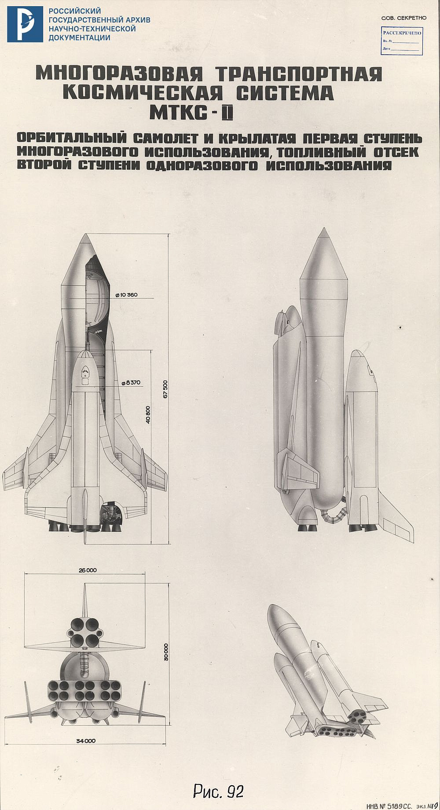
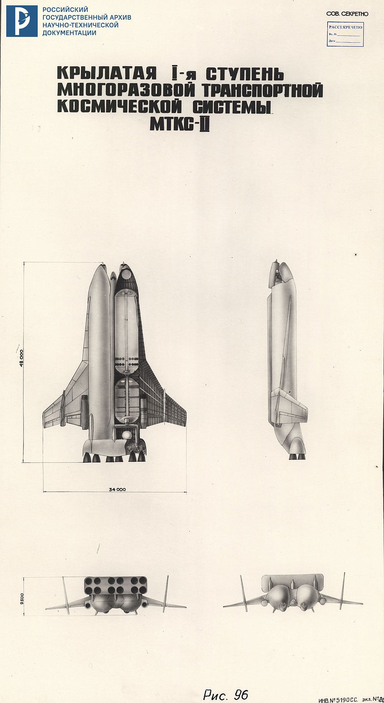

USSR MINISTRY OF GENERAL MACHINE-BUILDING

SCIENTIFIC AND PRODUCTION ASSOCIATION

«ENERGIYA»

«APPROVED»
DIRECTOR AND GENERAL DESIGNER ACADEMICIAN
--- (GLUSHKO)
1974

«APPROVED»
GENERAL DESIGNER OF THE MOSCOW MACHINE-BUILDING PLANT «OPYT»
--- (TUPOLEV)
1974

COMPLEX ROCKET AND SPACE PROGRAM

TECHNICAL PROPOSALS

VOLUME III

REUSABLE SPACE TRANSPORT SYSTEM

2\. COMPOSITION OF SYSTEMS AND BASIC REQUIREMENTS FOR THE MTKS COMPLEX

2.1. Composition of the complex systems

The MTKS complex includes systems for preparing and
conducting launch, launching and returning payloads.

2.1.1. The reusable transport space launch and return system is a two-stage rocket with a reusable orbital aircraft for return.

The first stage consists of two modular rocket blocks A of the RLA-120 launch vehicle with RD-150 engines, with sea level thrust increased to 1200 tf.

The second stage includes an orbital aircraft and an external fuel compartment, which is dropped on the insertion trajectory after the working fuel supply is exhausted. The second stage engines are located on the orbital aircraft and are functionally connected to the outboard fuel compartment and OS systems during insertion and emergency situations.

The orbital aircraft (RLA-135) is a hypersonic vehicle with a double-swept wing and vertical tail, equipped with liquid rocket engines for orbital maneuvering and jet control.

The draft technical specifications [1] also provide for the study of the possibility of creating a cargo version by replacing a reusable orbital aircraft with a disposable rocket unit with an ejectable payload, using propulsion system and elements of the second stage control system. Due to the lack of data on payloads, such an option was not studied at this stage.

2.1.2. The launch preparation and execution system is a ground-based MTKS support complex and consists of a launch-landing and command-measuring complex.

The launch and landing complex includes a launch position with autonomous launch devices, a technical position with an installation and testing building, a repair and restoration plant, as well as a landing strip with platforms and after-flight service stations.
The command and measurement complex includes control and measurement processing centers, ground receiving and transmitting points and search and rescue equipment.
The detailed composition of the constituent elements of the main systems of the MTKS complex is given in the corresponding sections of the technical proposal.

2.2. Basic requirements for MTKS complex systems

2.2.1. Requirements for the launch and return system

On the payload side, the main requirements for the launch system are as follows:

the payload mass launched by the launch system into the reference circular orbit of the satellite (with an inclination to the equator i = 51.6° at an altitude Hcr = 200 km) should be 40 tons;

the payload mass returned from the reference orbit in the cargo compartment of the orbital aircraft must be 20 tons;

reference launch paths are characterized by orbital inclinations i = 91-102° and i = 51-63°

Requirements for the elements of building an extraction system:

fuel components of the second stage, non-toxic oxygen (oxygen-kerosene for the combustion engine, peri-hydrogen for the second stage combustion engine);

MTKS stages should consist of unified modules of the launch vehicle system with minimal modifications.

General requirements for the components and elements of the launch and return system are given in the relevant sections of the technical proposal.

2.2.2. The requirements for the ground-based support complex, in terms of determining the technical capabilities and costs of creating a ground-based complex, are as follows:

the ground complex should provide a program of 20-25 launches per year with a guaranteed period of reliable operation of 10 years;

the MTKS launch and landing complex must provide direct launching objects into synchronous solar orbits (i = 97-102) and orbits with an inclination in the range i = 51-63°;

two autonomous starting devices must allow parallel preparation and launch of two products;

the technical position must ensure the simultaneous assembly of two products;

The landing strip with dimensions of 5x0.1 km is located near the launch complex.

3\. JUSTIFICATION OF THE PRINCIPAL LAYOUT OF THE MTKS

The basic layout diagram significantly affects the geometric and mass characteristics of the launch system.

The following general requirements apply to its selection:

ensuring minimal costs for development and production;
maximum degree of use of standardized components and assemblies;
taking into account the technical capabilities of the existing production base.

The decisive moment for the construction of the entire reusable transport space system is the choice of the layout scheme of the orbital aircraft.

3.1. Orbital aircraft layout

The layout of the orbital aircraft (OS) is determined by the basic requirements given in Section 2.

The implementation of these requirements clearly determines the need to use an aircraft design [2]. The peculiarity of the aerodynamic configuration is due to the operation of the aircraft in a wide range of speeds (0.5 < M < &20), covering hypersonic speeds during descent from orbit and aerodynamic braking and subsonic speeds during landing. Ensuring high flight performance in these conditions predetermines the use of a lifting fuselage with a double-swept wing and developed vertical (tail) empennage.

The use of the OS as a universal vehicle with the aim of reducing the impact of external factors on the launched and returned payload determines the need for internal cargo compartment with controlled pressure and temperature conditions. The dimensions of the cargo compartment are determined by the payload class specified by the design [1].

The placement of the first stage propulsion system on the OS forms the configuration and dimensions of the rear fuselage compartment, and also determines the lateral placement of the OS relative to the launch vehicle and the principles of constructing mechanical and hydraulic connections.

The crew cabin is located in the forward part of the fuselage and is designed as a removable unit that does not participate in the power circuit. This solution allows for autonomous testing of the cabin and its systems and can simplify the organization of crew rescue in a number of emergency
situations.

To protect the structure from the effects of high temperatures during ascent and descent, it is envisaged to use removable heat-protective panels on surface areas where the heating temperature exceeds 1500°C.

The external OS configuration is shown in Fig. I.

3.2. Layout diagram of MTKS-I

In accordance with the composition of MTKS-I given in Section 2, it includes the RLA-135 orbital aircraft, an external fuel compartment and the first stage.

To ensure the maximum unification of the modular rocket blocks of the launch vehicle system being developed by NPO Energia, the design of the MTKS-I layout diagram (Fig. 2) is based on the rocket blocks of the first stage of the RLA-120, and the central modular block of the Ts MTKS is used on the RLA-150 launch vehicle also as a second stage.

Fig. 1 - Orbital Aircraft

Fig. 2 - MTKS-I system

[...]

11\. TECHNICAL CHARACTERISTICS OF THE REUSABLE SPACE TRANSPORT SYSTEM AND ITS COMPONENTS

11.1. Orbital plane

11.1.1. Overall dimensions, m:
length - 41.4
height including vertical tail (without landing gear) - 14.5
wingspan - 26
cargo compartment diameter - 5
cargo compartment length - 20

11.1.2. Mass characteristics, t:
at the moment of launch of the MTKS on the AES with an inclination to the equatorial plane i=51.6° - 171
on an AES with an apogee of 200 km and a perigee of 80 km (i = 51.6°) - 154
on the satellite with Ncr=200 km (i = 51.6°) - 152
structure - 94.5
during normal landing - 115
during an emergency landing - 164
fuel for recovery from an emergency during the first 40 seconds of flight - 6.78
fuel for orbital maneuvering and jet control (working reserve) - 23.76

11.1.3. Number and types of engines:
second stage - 4 oxygen-hydrogen liquid fuel engines
orbital maneuvering - 2 liquid fuel engines
reactive control - 40 liquid reaction control engines, 10 vernier engines
11.1.4. Nominal engine thrust in vacuum, tf:
second stage - 250
orbital maneuvering - 3.5
reaction control - 0.4

11.1.5. Engine propellant components:
second stage - O2+H2
orbital maneuvering and reaction control - N2O4+UDMH

11.1.6. Throttle range of second stage engines, % -50...+9

11.1.7. Crew compartment volume, m³:
general - 120
working - 80

11.1.8. Number of astronauts:
crew - 3
passengers (due to reduction in payload mass) - up to 6

11.1.9. Duration of stay on the satellite:
standard - up to 7 days
with additionally consumed reserves of mass for the
operation of on-board systems and life support - up to 30 days

11.1.10. Crossrange due to the use of aerodynamic quality, km ±2000

11.1.11. Landing speed, km/h:
during normal landing - 280-320
during emergency landing - 360-370

11.1.12. Operational lifetime, flights:
airframe - no less than 100
engines - 50, with refurbishment up to 100

11.2. External tank

11.2.1. Overall dimensions, m:
length - 56.2
oxygen tank diameter - 10.36
hydrogen tank diameter - 8.37

11.2.2. Mass characteristics, t:
when fully fuelled - 982
at launch - 977.4
at MTKS-I first stage separation - 632.5
at orbiter separation - 67.9
working fuel reserve - 909.5
refillable fuel supply - 917.5

11.2.3. Operational lifetime, flights - 1

11.3. First stage of MTKS-I

11.3.1. Number of modular blocks A - 2

11.3.2. Overall dimensions of blocks A1 and A2 of the first stage, m:
length - 43.8
diameter by tanks - 6.0
on fairings of steering engines - 9.2

11.3.3. Mass characteristics, t:
fully fueled - 1647
at launch - 1638
at separation - 162
working fuel reserve - 1476
refillable fuel supply - 1507.5

11.3.4. Fuel components:
oxidizer - liquid oxygen
fuel - RG-1

11.3.5. Number and types of engines:
first stage - 2 x RD-150
second stage - 4 x RD-1246

11.3.6. Nominal thrust of engines at sea level, tf: first stage - 2 x 1200
second stage - 4 x 112.5

11.3.7. Operational lifetime, flights - 1

11.4. Launch vehicle MTKS-I

11.4.1. Dimensions, m:
length - 67.5
height (according to the vertical tail of the OS) - 24
width (according to OS wingspan) - 26

11.4.2. Max characteristics, t:
fully fueled - 2800
at launch - 2786.5
at first stage cut-off - 965.6
at first stage separation - 803.6
at second stage cut-off - 232.2

11.4.3. Nominal thrust of engines at
liftoff, tf - 3626

11.4.4. Thrust-to-weight ratio:
at start - 1.30
second stage (after separation) - 1.24

11.4.5. Payload mass, launched in the OS cargo compartment, t:
to a reference circular orbit of an artificial satellite with a height of 200 km at inclination і =51.6° - 40 (with dV reserve of 120 m/s)
to a polar orbit with Ncr = 200 km - 29.5
to an orbit with a height of Ncr = 400 km at inclination і =97° - 20

Fig. 84 - MTKS-II system

Fig. 92 - MTKS-II system

Fig. 96 - MTKS-II flyback booster