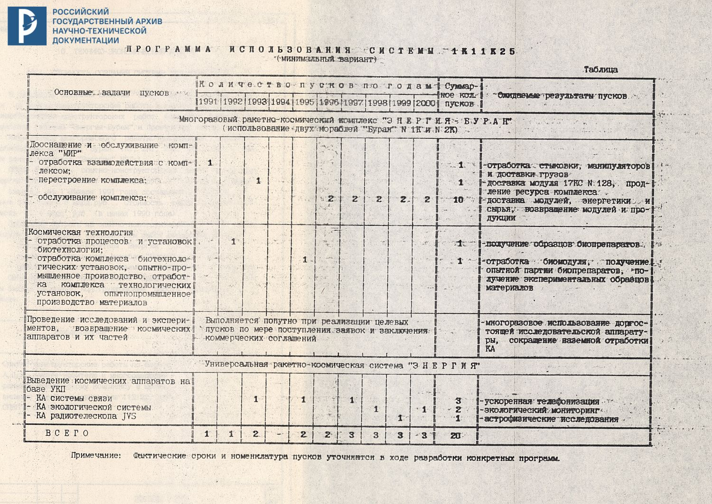
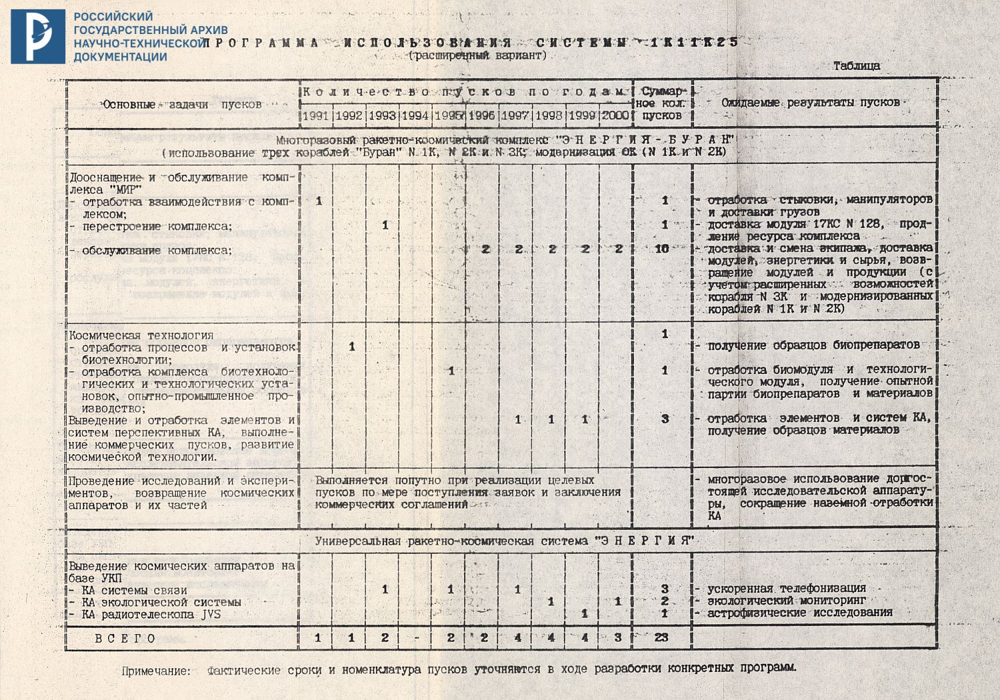

Научно — производственное объединение

"Энергия"

имени академика С.П.Королева

Целевое использование системы 1К11К25

технический отчет
П29506 — 105

Генеральный директор - Главный конструктор НПО "Молния"

Г.Е. Лозино-Лозинский

Генеральный директор, Генеральный конструктор

Ю.П. Семенов

1991г.

РГАНТД  

Фонд 213
Опись 2с-1
Дело 309с

[...]

2. РАЗВЕРТЫВАНИЕ И ОБСЛУЖИВАНИЕ ОРБИТАЛЬНЫХ КОСМИЧЕСКИХ КОМПЛЕКСОВ ТИПА "МИР"

В рамках поиска оптимальных путей дальнейшего развития космических орбитальных комплексов тина "Мир" и повышения их эффективности представляется оправданным, а в ряде случаев - единственно возможным, использование орбитального корабля "Буран". Ближайшее взаимодействие беспилотного орбитального корабля "Буран" М 2 со станцией "Мир" намечено на 1991-92 годы с задачей отработки средств и методов сближения и стыковки, средств и методов орбитального технического обслуживания, включая отработку действий экипажа станции.

Базовый блок ныне действующей станции "Мир", на которой выполняются исследования и работы по международным контрактам постепенно исчерпывает свои ресурсы, и его результативное использование возможно, по оценке специалистов, до 1993.- 1994 года. Е этому времени станция. будет оснащена модулями: "Квант", "Квант-2", "Кристал" [sic!], "Спектр" и "Природа", большинство из которых могли бы продолжать активную работу на орбите и дальше. С учетом серьезных финансовых ограничений по созданию станции "Мир-2” и неопределенностью по срокам начала ее развертывания предлагается реализовать дальнейщее развитие станции "Мир" введением в ее состав базового блока 17КС N 128. При этом операции по перестроению (реконфигурации) орбитального комнлекса с решением вадач продления использования модулей может выполнить орбитальный корабль "Буран" с использованием своих бортовых манипуляторов (см. рис.1). Реконфигурация комплекса может СЫТЬ осуществлена в 1993 году в рамках программы летных испытаний орбитального корабля "Буран" при пилотируемом пуске. Такое использование орбитального корабля "Буран" имеет большое научно-техническое значение, открывая перспективу обслуживания и развертывания с его помощью орбитальных комплексов. Эффективность взаимодействия будет выше, если обслуживание орбитального комплекса "Мир" в последующем будет проводиться е использованием усовершенствованного орбитального корабля "Буран" N 3К (включаюшего новую кабину экипажа на четыре человека и доведения массы полезного груза до 30 тонн) и модифицированных ( доработка кабины экипажа на четыре человека и др.) кораблей NN 1К и 2К.

Значительное развитие с использованием орбитального корабля "Буран" получает биотехнологическое производство хозяйственно-полезных биопрепаратов и технологическое производство материалов. Содержание и необходимость этих работ раскрыты в последуюших разделах. В этих направлених‘ орбитальный корабль "Буран" используется как в автономных полетах, так и в обеспечение транспортно-технического обслуживания. Основные задачи автономных полетов корабля 2К2 ( в 1992 году) и 2К3 (или 3К1) в 1995 году связаны с отработкой биотехнологических установок и биомодулей для последующей их эксплуатации на борту’ комплекса "Мир".

Основными задачами транспортно-технического обслуживания комплекса "Мир" являются ежегодная доставка биомодуля З7КБТ с последующим его возвращением для профилактики, возвращение наработанной продукции, доставка энергетического модуля и другой целевой и научной аппаратуры для повышения энерговооруженноети орбитального. комплекса и его дооснащения.

Для выполнения этих работ предусматриваются пуски двух орбитальных кораблей "Буран" в год в период с 1996 по 2000 год.

Указанная программа развертывания и ОЕ ЕНИЯ орбитального комплекса "Мир" приведена на рис. 2.

После 2000 года планируется дальнейшее расширение использования орбитального корабля "Буран" в программе "Мир" в связи с ожидаемым возрастанием потребного грузопотока и расширением задач обслуживания.

3.1. ТЕХНОЛОГИЯ И БИОТЕХНОЛОГИЯ

Программа проведения работ по космической технологии предусматривает использование орбитального корабля "Буран" для решения
следуюших задач:

а) на борту орбитального корабля "Буран"
- отработка опытно-промышленного и промышленного технологического и вспомогательного оборудования в натурных условиях;
- получение опытных партий материалов для электронной и оптичесной промышленности;
б) в качестве транспортного средства для доставки оборудования и материалов на борт орбитальной станции типа "Мир" и возврашения оборудования и полученных материалов на землю.

Е зависимости от энергетических возможностей "Бурана", прополжительности полетов, присутствия или отсутствия операторов, а также обеспечения ряда специальных требований возможно проведение отработок оборудования и технологических процессов предназначенных для длительного использования на орбитальной станции типа "Мир".

В процессе проведения отработок оборудования и технологических процессов на борту орбитального корабля "Буран" можно организовать получение опытных партий материалов для тет ронно и оптической промышленности.

Перечень технологического и вспомогательного оборудования, а также требования н обеспечению его функционирования, представлены в таблице.

Таблица 

|Наименование аппаратуры, разработчик|Задачи эксперимента|Характеристики||Участие операторов|Год начала експлуатации|
|---|---|---|---|---|---|
|||Масса, кг|Цикл работы|||
|"БСС" - бортовой сейсмо-приемник МИСИ|Измерение и регистрация микроускорений|24|непрерывно|не требуется|1991|
|наименование аппаратуры, разработчик|
|"Дакон" - блок датчиков конвекции ИПМ АН СССР|Исследование влияния микроускорений на конвективные процессы|20|10 час в сутки|не требуется|1992|
|"Молекулярный экран" ИЭС АН СССР|Овеспечение вакуумирования|500|до 3 суток|не требуется|1995|
|"УК_02" ГОИ, КБ ОМ|Получение градиентных стекол|до 100|60 час|не требуется|1992|
|"УК_03" ГОИ, КБ ОМ|Получение градиентных стекол|до 100|60 час|не требуется|1994|
|"Нота-П" ИЭС АН СССР|Бестигельная зонная плавка кремля|до 500|612 час|требуется|1994|
|"Кратер-АГ" НПО "Научный центрс"|Получение монокристала арсенида галлия|500|до 200 часов|не требуется|1994|
|"Малахит" НПО "Научный центрс"|Получение пластик эпитаксиального кремля|до 500|2,5 ча|не требуется|1994|

Для получения высококачественных материалов на установках "УК-02", "УК-03", "Бота-П", “Ератер-АГ" и "Малахит" на борту “Бурана” во время проведения технологических процессов необходимо обеспечить минимальный уровень микроускорений 10 ^-5 - 10 ^-6 g0.

В течение одного технологического процесса на установке "Нота-П” получается монокристалл кремния массой до 20 кг за 12 часов, На установке "Ератер-АТ" монокристалл арсенида галлия массой до 4 кг за 200 часов, на установке "УК-02" градиентное стекло массой 0,2 кг за 60 часов и на установке "Малахит" одна пластина эпитансиального кремния за &,о часа.

При обеспечении непрерывного функционирования технологических установок "Нота-П", "ратер-АГ", "УК-Ое" (или "УК-03"), и "Малахит" на борту орбитального корабля "Буран" в течение 30 суток возможно получение материалов для электронной и оптической промышленности (кремний, арсенид галлия, окись цинка, теллурид кадмия, эпитаксиальные структуры, градиентные стекла и другие материалы) на сумму до 20 млн. рублей.

В соответствии с "Комплекеной целевой программой работ покосмическому материаловедению на 1986-2000 год на орбитальной станции типа "Мир"" планируется организация промышленного произ водства материалов для электронной промышленности. Для организации этого производства предполагается использовать установки, которые пройдут предварительную отработку на орбитальном корабле "Буран".

Основное содержание предлагаемых исследовательских и опытных работ по биотехнологии на корабле "Буран" в период 1992 - 1994 г. для производства биопрепаратов с его использованием до 2000 г. заключается в следующем. На этом изделии до 1995 г. должны производитея многоплановые исследования, поэзтапная и комплексная отработка различных биотехнологических процессов, использующих преимущества микрогравитациии, начиная с отдельных стадий отработки биообъектов и до реализации полного производственного цикла. Одновременно планируется получение экспериментальных и опытных партий белковых препаратов, а также клеточных культур, полупроведниковых материалов, стекла и др.

На последнем этапе натурной отработки в 1994-95 годах должны быть проведены комлексные 20-30 суточные испытания опытно-промышленной биотехнологической аппаратуры в составе специализированного обитаемого биотехнологического модуля, на базе З7КЕТ, который, начиная с 1996 года будет эксплуатироваться в составе орбитальной станции "Мир" (с базовым блоком 17КС N128).

В состав модуля будут входить комплексы биотехнологических установок, прошедших ранее экспериментальную отработку в научных исследованиях, а также экспериментальные установки новых типов и аппаратура для научных исследований.

За период 1992-1994 годы (в 2-х этапах научных исследований) может быть получена бисотехнологическая продукция на сумму до 25 млн. рублей и накоплены необходимые данные для создания и экоплуатации бортовых биотехнологических производств полного цикла.

В ходе 20-30 суточного ЛКИ модуля в составе орбитального корабля "Буран" должны быть получены экспериментальные данные о готовности бистехнологических производств и аппаратуры специализированного модуля к длительной эксплуатации в составе орбитальной станции типа "Мир", а также научная информация по биотехнологии для фундаментальных исследований и разработки новых технологий.

Наряду с этим должны быть произведены эначительные опытно-промышленные партии биопрепаратов для испытания и практичесного использования в медицинской промышленности и здравоохранении.

В 1994-1995 г. за этап ЛКИ модуля (за 20 суток) чожет быть получена продукции на сумму около 230 млн. рублей. (предварит. оценка).

На последующих этапах экоплуатации орбитального корабля "Буран", после 1995 года и до 2000 года требуется его участие в периодическом, е раза в год, обслуживании биотехнологического модуля, находящегося в составе орбитальной станции тыпа "Мир".
Обслуживание биотехнологического модуля предусматривает:
- доставку расходуемых компонентов и исходных биологических материалов массой около 4,0 тонн в гол;
- возвращение контейнеров с готовой продукцией массой около,
0,5 тонн в год;
- возвращение модуля один раз в год для осуществления особо сложных заводских регламентных работ с биотехнологическим обобудованием и его обновлением.

В период 1992-1994 годов на орбитальном корабле "Буран" предусматривается проведение исследовательеких, экопериментальных и опытна-промышленных работ по биотехнологии в следующих направлениях:
- получение новых продуцентов хозяйственно-ценных биопрепаратов, являющихся источниками лекарственных и других препаратов;
- культивирование продуцентов биопрепаратов с целью отработки бортовых технологий получения исходных биологических продуктов для последующего разделения и очистки их на специализированном модуле;
- разделение и очистка различных биопрепаратов электрофоретическими и другими физико-химическими методами с целью получения особо чистых биообъектов для практического применения в народном хозяйстве;
- Получение готовых биопрепаратов, включая выращивание монокристаллов различных биологических объектов для использования в исоледованиях, позволяющих повысить эффективность и расширить сферу применения биопрепаратов в народном хозяйстве, а такие подготовку биспрепаратов К возвращению в форме, обеспечивающей их сохранность.

Лля справки следует отметить, что ожидаемые общие затраты на разработку и создание новых биотехнологических процессов и специализированной научной и онытно-прмывленной аппаратуры, на опытно-конструкторские работы по созданию биомодуля, на изготовление 2-х его экземпляров и их наземные испытания составят около 300 млн. рублей.

Затраты на обновление специализированной биотехнологической аппаратуры двух модулей (периодически) доставляемых с орбиты на Землю с помощью орбитального корабля Буран" и регламентное наземное обелуживание модулей в период 1995-2000 годы составит около 30 млн. рублей в год.

указанные затраты не входят в экономический баланс орбитального корабля "Буран", относятся к экономическим показателям использования станции типа "Мир" и окупаются за счет ожидаемого экономического эффекта от получения на модулях в составе орбитальной станции биотехнологической продукции в период 1997-2000 гг отоимостью от 0,6 до 1 млрд. рублей в год.

Биотехнологическая лаборатория с опытно-промышленным производством должна быть размещена на постоянно обслуживаемом операторами специализированном модуле, функционирующем в составе базового блока станции "Мир".

В состав биотехнологического специализированного оборудования входят сиетемы и аппаратура для выполнения различных видов работ:
- для углубления научных исследований физико-химических и микробиологических процессов в биологических средах;
- для частичной или полной оперативности обработки научной информации;
- экспериментальной оценки И отработки перспективной бортовой биотехнологической аппаратуры;
- получения опытно-промывленных партий особо ценных биопрепаратов по ваказам различных организаций, а также для отработки технологических процессов промышленного осистехнологического производства.

К числу научной аппаратуры, в работе с которой необходимо ностоянное участие человека, относятся приборы для решения следующих задач:
- изучения методов культивирования клеток тканей;
- изучение процесесв роста клеток на микросферах;
- исследование явлений злектроориентации и изучения клеток;
- гибридизации и электрослияния клеток, а такие трансформации ДНК в электрическом поле;
- дезинтеграции микроорганиемов-продуцентов.

На аппаратуре, требующей периодического участия операторов для наблюдений аа ходом процессов, оперативной обработки, анализа полученных данных и коррекции режимов экспериментов проводятся следующие работы:
- выделение мутантных клеток на основе явления хенмотаксиса;
- исследование и отработка электрофоретических и электромагнитных методов разделения клеток;
- длительное изучение физиологии и морфологии клеток в процессах периодического и непрерывного культивирования;
- культивирование с рециклом питательной среды;
- Исследования по мембранной технологии разпеления бисосъектов;
- разделение биообъектов в двухфазных системах;
- иселедование кинетики процессов кристаллизации белков и вирусов;
- иымобилизация и адсорбция биокомпонентов на специфических подложках;
- иммуносенсорное определение качества получаемых белковых препаратов.

Автоматизированные биотехнологические установки, обеспечивающие получение малых и опытно- промышленных партий биопрепаратов, требуют участия операторской деятельности лишь на начальном и заключительном этапах работы, а также в период регламентного обслуживания аппаратуры. к числу. этих работ относятся:
- обслуживание автоматизированных модулей культивирования
продуцентов и контроля продукции;
- обслуживание электрофоретических опытно- промышленных установок различных типов;
- кристаллизация белков и вирусов;
- оболуживание систем утилизации сиотехнологических отходов:
- обслуживание линий сушки и приготовления готовых ленарственных форм биопрепаратов.

Эксплуатация и обслуживание биотехнологического оборудования осуществляется операторами от 1 до 3 человек, имеющими специальную подготовку.

3. 2. ИССЛЕДОВАНИЯ В ИНТЕРЕСАХ НАУКИ И ПРИКЛАДНЫХ ПРОГРАММ

На этапе летных испытаний орбитального корабля "Буран" наряду с проведением специальных и технических исследований и экспериментов (см. раздел 3.1.), целью которых является получение исходных данных для создания перспективных космических ередств, предусматриваются исследования в интересах науки.

Например, для получения экспериментальных данных по ядерной и электронной компонентам, космических лучей с целью уточнения требований к новой элементной базе перспективных космических аппаратов будет проведен эксперимент "Терек" на аппаратуре разаработки НИИЯФ МГУ. В ходе эксперимента измеряются энергетические спектры протонов и ядер в области энергий 10-1000 ТэВ/частицу и потоки электронов в области энергий более 1 ТэВ.

В настоящее время имеется ряд заявок на проведение экспериметов и исследований от АН СССР и заинтересованных организаций, к примеру:

1. ИКИ АН СССР считает наиболее перспективными областями использования для орбитального корабля "Буран" в целях космических исследований следующее:
- плазменные и волновые эксперименты в целях фундаментальных и прикладных исследований;
- иИвучение спектра и зарядового состава космических лучей, поиск трансурановых элементов методом зкопонирования на орбите больших площадей ядерных эмульсий с последующим возвращением результатов на Землю;
- отработка отдельных узлов и систем перспективных дорогостоящих комплексов НА.

2. Инетитут геохимии и аналитической химии им. В.И. Вернадского предлагает программу исследований и экспериментов на период до 2000 года по дистанционному зондированию Мирового океана в аспектах изучения взаимодействия "океан - атмосфера", экологического состояния океана и изучения поверхностных следов ППЛ в океане (головная научная организация ГЕОХИ АН СССР) с установкой на орбитальном корабле "Буран" следующей аппаратуры:
- трехдиапазонной МРЛС "Образ" (ИРЭ АН УССР), НИИ РП Минобщемаш (1995-1996 годы);
- когерентно-оптического прибора "Образ" - "Планета" (АО ХГУ, ВНИЦ "Планета" при ГЕОХИ АН СССР, НИИ КП Главкосмоса СССР), 1995-1996 годы;
- лидарной аппаратуры (ИФ АН Лит. ССР, ВНИЩ "Планета" при ГЕОХИ АН СССР, НИИ КИ Главкосмоеа СССР) 1997-1998 годы.

Наряду с этим инетитут считает, что одной из экономически оправданных задач для орбитального корабля "Буран" в исоледованиях планет солнечной системы может в недалеком будущем стать использование его как элемента транспортной системы для доставки на лунную орбиту необходимого оборудования для лунных баз, создание которых планируется США и Японией.

Экономически оправданным такое использование может стать при наличии дополнительных средств, обеспечивающих автоматический вывод полезной нагрузки на лунную орбиту и достижения договоренноети с США и Японией о коммерческом использовании орбитального корабля "Буран" для этой цели.

3. Институт радиотехники и электроники - предлагает разовое использование орбитального корабля "Буран" для решения крупных экологических и народно-хозяйственных задач при наличии аппаратуры (например - разрабатываемой по программе "Территория").

эти задачи могут быть частями программы полета. К ним могут быть отнесены:
- контроль гидрологического режима заданной территорни;
- картирование ледового покрова;
- картирование состояния почвы и растительного покрова и др.

Проведение на орбитальном корабле "Буран" научных экепериментов, попутно с реализацией штатных программ, позволит осуществить повторное применение комплектов исследовательской аппаратуры, снизить продолжительность ее нахождения в космосе в дежурном рехиме и, тем самым, сократить стоимость проведения экспериментов и повысить оперативность получения результатов.

3. 3. МЕЖДУНАРОДНОЕ СОТРУДНИЧЕСТВО

Международное сотрудничество в зависимости от поставленных задач в области космических исследований основывается на двух формах - на коммерческой основе и на основе научно-технического сотрудничества.

Научно-техничеекое сотрудничество проводится с иностранными государствами и фирмами по реализации совместных экспериментов в интересах науки и народного хозяйства.

Создание космического комплекса 111825 значительно раеширяет возможности использования космического пространства для развития науки, народного хозяйства, а также реализации программ международного сотрудничества. В связи с этим рекомендуется для ВИТЬ потенциальных потребителей нашей космической техники и организовать с зарубежными партнерами разработку, изготовление и оснащение научной аппаратурой специализированных исоледовательских модулей.

В настоящее время программа международного сотрудничества включает в себя следующие основные направления, по которым целесообразно проводить разработку специализированных модулей:
- астрофизический - для исследования Солнца в широкой области спектра (от ультробиолетового до жесткого ренгеновского и гамма-излучения) (совместно с ЕКА), комплексного исследования горячих звезд, скопления галактик и т.д. в субмиллиметровом диапазоне (совместно е ЕКА).
- медико-биологический - отработка медико-теухнических аспектов обеспечения пилотируемых межпланетных полетов, проведение функциональных и прикладных исследований в области биологических наук (совместно со странами Запада и Восточной Европы, США, Япония).
- технологический - промышленное производство полупроводниковых материалов и биопрепаратов, дальнейшее исследование фундаментальных процессов космического материаловедения и биотехнологии (совместно с США, Швейцарией, Японией, Канадой, Францией,ФРГ)
- дистанционное зондирование земли - решение глобальных экологических задач, контроль за восстанавливающимися и невосстанавливающимися ресурсами, создание климатической модели Земли (совместно с ЕКА, США, Канадой, Японией).

[illegible] глобальной задачей. которую можно решить с помощью системы 1К11К25 является спасение экипажея и обеспечение безопасности полетов.

З евязи с расвирением количества стран, участвующих в равработке пилотируемых средств (СОСР, США, ЕКА, Япония, Китай), возникает необходимость обеспечения безопасности полетов и спасевия экипаяей. В настоящее время существует Программа Международной Организации по стандартизации (ISO) в раыках технического комитета ТЕ-20 "Авиапиовные космические летательные апбараты”", задачей которой является стандартизация и унификация космической техники. В рамках этой программы будут разрабатываться унифициууванные системы и агрегаты (слежения, облинения, стыковки, шлюзования, низнеобеспечения и т.д.) для оснащения космической пилотируемой техники и для обеспечения безопасности пилотируемых полетов. Участие в этих работах специалистов СССР является необходимым для внесения вклада в международную космовавтику и сохранения позиций СССР зв освоевии космического простравства.

Международное сотрудничество в области пилотируемых полетов на коммерческой и номпенсационвой основе позволяет:
- испольвовать эковомические преимущества ‚междупародного разделения труда;
- создать наиболее благоприятную международную атмосферу для реализации отечественной пилотируемой программы.

Программы яа коммерческой основе:
- обеспечиваю? знопорт высокотехнологичной техники и иняенерных услуг, валютные поступления или поставили компьютерной и другой техники и продукции в объеме, окупающем затраты на программы;
- обеспечивают заказы и занятость кооперации отрасли по основной тематике и средства для ее развития;
- обеспечивают сохранение и стабилизируют развитие унивального народного достояния - конкурентоспособного на мировом рынке научно-технического потенциала ракетно-космической отрасли.

Использование "Бурана" как в сочетании ес комплексом типа "Мир", так и в автономных полетах расширяет возможность выбора областей международного сотрудничества в части обслуживания иностранных КА на орбите, снятия неисправных КА с орбиты и возвращения их на Землю (что может заинтересовать, например, страховые кампании) и др. Конкретные области коммерческого исвользования ОК "Буран" и РН "Энергия" могут быть определены после фанктического заключения контрактов.

[...]

9. ПРОГРАММА ИСПОЛЬЗОВАНИЯ СИСТЕМЫ 1К11К25

Особенностью предлагаемой программы использования системы "Энергия-Вуран" (1К11К25) является ее практическая многоплановая реализация уже на этапе летных испытаний этой системы (период до 1995г.) с наращиванием решаемых задач на этапе штатной эксплуатации.

Программа использования включает в качестве основных разцелов дооснащение и обслуживание орбитального номплекса "Мир", решение задач космической технологии, выведение тяжелых космических аппаратов на базе УКИ.

В таблице представлена программа использования (по минимуму) системы "Энергия-Буран". до 2000 года. Программа составлена с учетом использования двух имеющихся орбитальных кораблей 1К и 3К "Буран", которые оборудованы под двух космонавтов, а также с учетом производственных мощностей завода "Прогресс" (обеспечивающих изготовление до 3 блоков Ц в Год).

В таблице представлена несколько расширенная программа мепользования системы "Энергия-Буран" до 2000 года, в варианте изготовления и ввода в эксплуатацию орбитального корабля 3К, оборудованного под четырех космонавтов и имеющего более совершенные системы и оборудование с улучшенными характеристиками, а также с учетом дооборудования орбитальных кораблей - 1К и 2К под четырех космонавтов (дооборудование "под 3К”).

При этом пополнительно реелизуются з автономных пуска орбитального корабля "Буран" в период 1997-1999гг.

В обоих вариантах программы предусматривается проведение исследований и экспериментов, & также возвращение космических аппаратов и их частей.

Эта часть программы выполняется попутно при реализации целевых пусков по мере поступления эвявск и заключения коммерческих соглашений и в последующем может развиться в ряд самостоятельных пусков.

