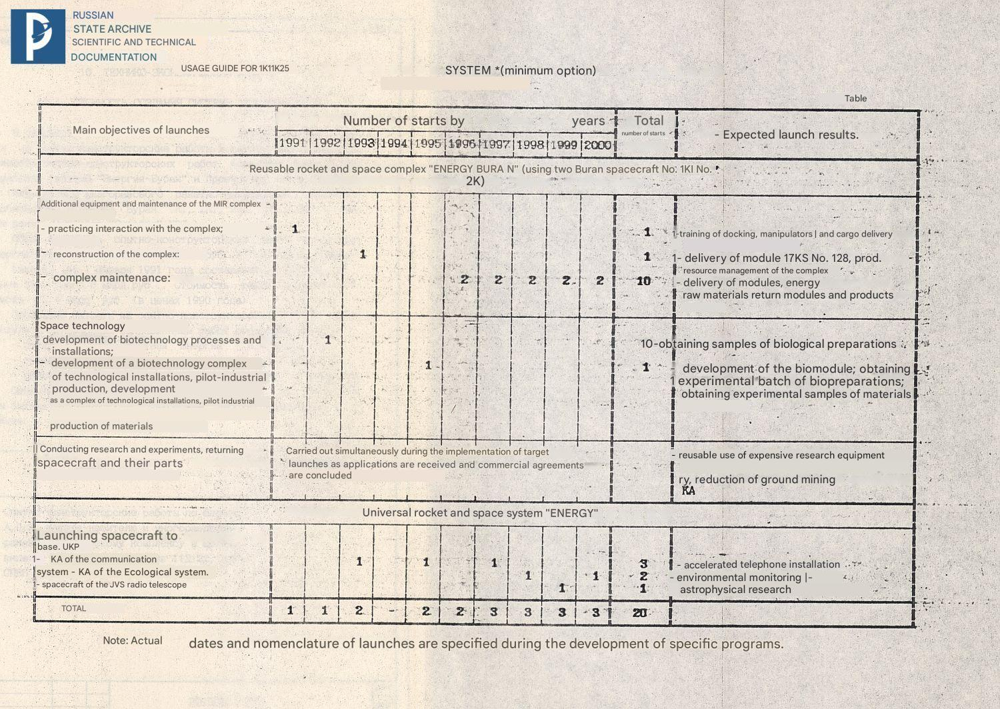
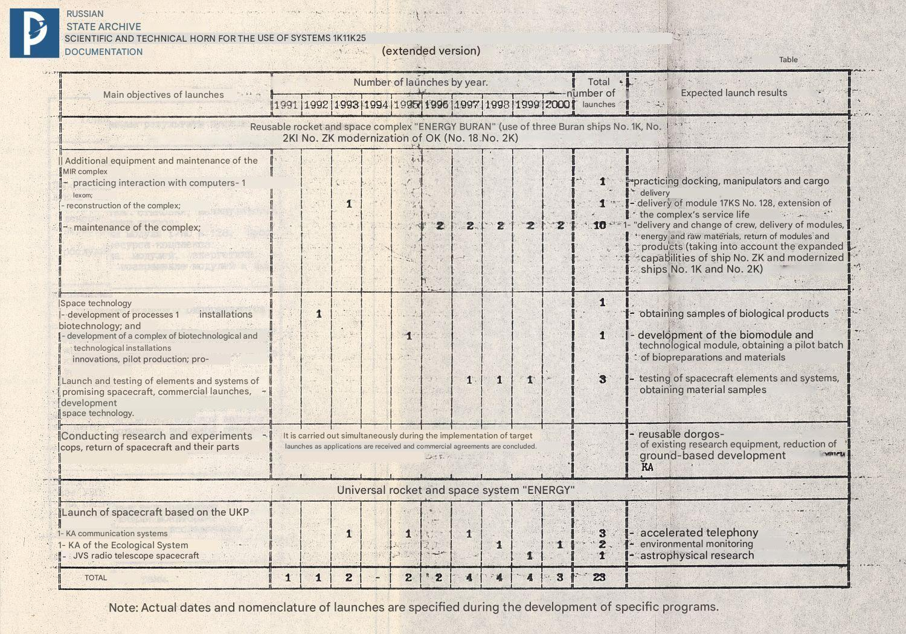

Scientific and Production Association

"Energia"

named after academician S.P. Korolev

Targeted use of the 1K11K25 system

technical report
P29506 — 105

General Director - Chief Designer of NPO "Molniya"

G.E. Lozino-Lozinsky

General Director, General Designer

Yu.P. Semenov

1991

RGANTD

Fund 213
Inventory 2s-1
Case 309s

[...]

2. DEPLOYMENT AND MAINTENANCE OF ORBITAL SPACE COMPLEXES OF THE "MIR" TYPE

As part of the search for optimal ways of further development of space orbital complexes of the "Mir" type and increasing their efficiency, it seems justified, and in some cases the only possible, to use the orbital ship "Buran". The nearest interaction of the unmanned orbital ship "Buran" M2 with the station "Mir" is planned for 1991-92 with the task of testing the means and methods of approach and docking, means and methods of orbital technical maintenance, including testing the actions of the station crew.

The base block of the currently operating station "Mir", on which research and work under international contracts are carried out, is gradually exhausting its resources, and its effective use is possible, according to experts, until 1993-1994. By this time, the station will be equipped with the modules: "Quantum", "Quantum-2", "Kristal" [sic!], "Spektr" and "Priroda", most of which could continue active work in orbit further. Taking into account the serious financial constraints on the creation of the Mir-2 station and the uncertainty regarding the timing of the start of its deployment, it is proposed to implement further development of the Mir station by introducing the 17KS N 128 base block into its composition. In this case, the operations on the rebuilding (reconfiguration) of the orbital complex with the solution of the problems of extending the use of modules can be performed by the Buran orbital ship using its onboard manipulators (see Fig. 1). The reconfiguration of the complex can be carried out in 1993 as part of the flight test program of the Buran orbital ship during a manned launch. Such use of the Buran orbital ship is of great scientific and technical importance, opening up the prospect of servicing and deploying orbital complexes with its help. The efficiency of interaction will be higher if servicing of the Mir orbital complex in the future is carried out using the improved Buran N 3K orbital ship (including a new crew cabin for four people and bringing the payload mass to 30 tons) and modified (upgrading the crew cabin for four people, etc.) of the NN 1K and 2K spacecraft.

Biotechnological production of commercially useful biopreparations and technological production of materials are significantly developed using the Buran orbital spacecraft. The content and necessity of these works are disclosed in the following sections. In these areas, the Buran orbital spacecraft is used both in autonomous flights and to provide transport and technical services. The main tasks of the autonomous flights of the 2K2 spacecraft (in 1992) and 2K3 (or 3K1) in 1995 are associated with the development of biotechnological installations and biomodules for their subsequent operation on board the Mir complex.

The main tasks of the transport and technical maintenance of the Mir complex are the annual delivery of the 37KBT biomodule with its subsequent return for preventive maintenance, the return of the developed products, the delivery of the power module and other target and scientific equipment to increase the power-equipped capacity of the orbital complex and its additional equipment.

To perform these works, it is planned to launch two Buran orbital ships per year in the period from 1996 to 2000.

The specified program for the deployment and maintenance of the Mir orbital complex is shown in Fig. 2.

After 2000, it is planned to further expand the use of the Buran orbital ship in the Mir program in connection with the expected increase in the required cargo flow and the expansion of maintenance tasks.

3.1. TECHNOLOGY AND BIOTECHNOLOGY

The program for carrying out work on space technology provides for the use of the Buran orbital ship to solve the following tasks:

a) on board the Buran orbital ship
- testing of pilot-industrial and industrial technological and auxiliary equipment in natural conditions;
- obtaining pilot batches of materials for the electronic and optical industries;
b) as a vehicle for delivering equipment and materials on board the Mir orbital station and returning the equipment and obtained materials to the ground.

Depending on the energy capabilities of Buran, the duration of flights, the presence or absence of operators, as well as the provision of a number of special requirements, it is possible to conduct testing of equipment and technological processes intended for long-term use on the Mir orbital station.

During the testing of equipment and technological processes on board the Buran orbital ship, it is possible to organize the receipt of experi-
ment batches of materials for the tetro and optical industries.

The list of process and auxiliary equipment, as well as the requirements for ensuring its operation, are presented in the table.

Table

|Equipment name, developer|Experiment tasks|Characteristics||Operator participation|Year of operation|
|---|---|---|---|---|
|||Mass, kg|Operation cycle|||
|"BSS" - onboard seismic receiver MISI|Measuring and recording microaccelerations|24|continuously|not required|1991|
|Equipment name, developer|
|"Dakon" - convection sensor unit IPM USSR Academy of Sciences|Study of the influence of microaccelerations on convective processes|20|10 hours per day|not required|1992|
|"Molecular Screen" IES USSR Academy of Sciences|Vacuumization|500|up to 3 days|not required|1995|
|"UK_02" GOI, KB OM|Obtaining gradient glasses|up to 100|60 hours|not required|1992|
|"UK_03" GOI, KB OM|Obtaining gradient glasses|up to 100|60 hours|not required|1994|
|"Nota-P" IES USSR Academy of Sciences|Crucibleless zone melting of the Kremlin|up to 500|612 hours|required|1994|
|"Krater-AG" NPO "Scientific Centers"|Obtaining a single crystal of gallium arsenide|500|up to 200 hours|not required|1994|
|"Malakhit" NPO "Scientific Center"|Obtaining plastic epitaxial kremlin|up to 500|2.5 hours|not required|1994|

To obtain high-quality materials at the UK-02, UK-03, Bota-P, "Erater-AG" and "Malakhit" installations on board the "Buran" during technological processes, it is necessary to ensure a minimum level of microaccelerations of 10 ^ -5 - 10 ^ -6 g0.

During one technological process at the "Nota-P" installation, a single crystal of silicon weighing up to 20 kg is obtained in 12 hours, at the "Erater-AT" installation, a single crystal of gallium arsenide weighing up to 4 kg in 200 hours, at the "UK-02" installation, gradient glass weighing 0.2 kg in 60 hours, and at the "Malakhit" installation, one wafer of epitaxial silicon in &,0 hours.

By ensuring the continuous operation of the Nota-P, Rater-AG, UK-Oe (or UK-03), and Malakhit process units on board the Buran orbital ship for 30 days, it will be possible to obtain materials for the electronic and optical industries (silicon, gallium arsenide, zinc oxide, cadmium telluride, epitaxial structures, gradient glasses, and other materials) worth up to 20 million rubles.

In accordance with the "Comprehensive Target Program of Work on Space Materials Science for 1986-2000 on the Mir Orbital Station," it is planned to organize industrial production of materials for the electronic industry. To organize this production, it is proposed to use units that will undergo preliminary testing on the Buran orbital ship.

The main content of the proposed research and experimental work on biotechnology on the Buran ship in the period 1992-1994 for the production of biopreparations with its use until 2000 is as follows. On this product until 1995, multi-faceted research, step-by-step and complex development of various biotechnological processes using the advantages of microgravity, starting with individual stages of development of bioobjects and up to the implementation of a full production cycle, should be carried out. At the same time, it is planned to obtain experimental and pilot batches of protein preparations, as well as cell cultures, semiconductor materials, glass, etc.

At the final stage of full-scale testing in 1994-95, comprehensive 20-30 day tests of pilot industrial biotechnological equipment should be carried out as part of a specialized habitable biotechnological module, based on Z7KET, which, starting in 1996, will be used as part of the Mir orbital station (with the 17KS N128 base block).

The module will include complexes of biotechnological installations that have previously undergone experimental testing in scientific research, as well as experimental installations of new types and equipment for scientific research.

During the period 1992-1994 (in 2 stages of scientific research), biotechnological products worth up to 25 million rubles can be obtained and the necessary data can be accumulated for the creation and operation of onboard biotechnological production of a full cycle.

During the 20-30 day LKI of the module as part of the orbital ship "Buran", experimental data on the readiness of biotechnological production and equipment of the specialized module for long-term operation as part of the orbital station of the "Mir" type, as well as scientific information on biotechnology for fundamental research and the development of new technologies should be obtained.

Along with this, significant pilot-industrial batches of biopreparations should be produced for testing and practical use in the medical industry and health care.

In 1994-1995, during the LKI stage of the module (for 20 days), products worth about 230 million rubles can be obtained. (preliminary estimate).

At subsequent stages of the operation of the orbital ship "Buran", after 1995 and until 2000, its participation in periodic, e times a year od, servicing the biotechnological module located as part of the Mir orbital station.
Servicing the biotechnological module includes:
- delivery of consumable components and initial biological materials weighing about 4.0 tons per head;
- return of containers with finished products weighing about,
0.5 tons per year;
- return of the module once a year to carry out particularly complex factory routine maintenance work with biotechnological equipment and its renewal.

In the period 1992-1994, research, experimental and pilot-industrial work on biotechnology in the following areas is planned to be carried out on the Buran orbital ship:
- obtaining new producers of economically valuable biopreparations, which are sources of drugs and other drugs;
- culturing producers of biopreparations in order to develop on-board technologies for obtaining initial biological products for subsequent separation and purification in a specialized module;
- separation and purification of various biopreparations by electrophoretic and other physical and chemical methods in order to obtain especially pure bioobjects for practical use in the national economy;
- Obtaining finished biopreparations, including growing monocrystals of various biological objects for use in research, allowing to increase the efficiency and expand the scope of application of biopreparations in the national economy, and such preparation of biopreparations for return in a form that ensures their safety.

For reference, it should be noted that the expected total costs for the development and creation of new biotechnological processes and specialized scientific and research equipment, for experimental design work on the creation of a biomodule, for the manufacture of 2 of its copies and their ground tests will amount to about 300 million rubles.

The costs of updating the specialized biotechnological equipment of the two modules (periodically) delivered from orbit to Earth using the Buran orbital ship and routine ground maintenance of the modules in the period 1995-2000 will amount to about 30 million rubles per year.

These costs are not included in the economic balance of the Buran orbital ship, relate to the economic indicators of using the Mir type station and are recouped due to the expected economic effect from obtaining biotechnological products on the modules as part of the orbital station in the period 1997-2000 worth from 0.6 to 1 billion rubles per year.

A biotechnological laboratory with pilot production should be located on a specialized module constantly serviced by operators, functioning as part of the base unit of the Mir station.

The specialized biotechnological equipment includes systems and equipment for performing various types of work:
- to deepen scientific research into physical, chemical and microbiological processes in biological environments;
- for partial or complete efficiency of scientific information processing;
- experimental evaluation and development of promising onboard biotechnological equipment;
- obtaining pilot-tested batches of particularly valuable biopreparations on orders from various organizations, as well as for development of technological processes of industrial axial-technological production.

Scientific equipment, in the work with which constant human participation is necessary, includes devices for solving the following problems:
- studying methods of tissue cell cultivation;
- studying cell growth processes on microspheres;
- studying the phenomena of electroorientation and cell study;
- hybridization and electrofusion of cells, and such transformations of DNA in an electric field;
- disintegration of producer microorganisms.

The following works are carried out on equipment that requires periodic participation of operators for observations of the course of processes, operational processing, analysis of the obtained data and correction of experimental modes:
- isolation of mutant cells based on the phenomenon of chenmotaxis;
- research and development of electrophoretic and electromagnetic methods of cell separation;
- long-term study of cell physiology and morphology in batch and continuous cultivation processes;
- cultivation with nutrient medium recycling;
- Research on membrane technology for separation of biofilms;
- separation of bioobjects in two-phase systems;
- study of the kinetics of protein and virus crystallization processes;
- mobilization and adsorption of biocomponents on specific substrates;
- immunosensory determination of the quality of the resulting protein preparations.

Automated biotechnological installations that ensure the production of small and pilot-industrial batches of biopreparations require operator participation only at the initial and final stages of operation, as well as during routine maintenance of the equipment. These works include:
- maintenance of automated modules for culturing producers and product control;
- maintenance of electrophoretic experiments industrial installations of various types;
- crystallization of proteins and viruses;
- servicing of systems for the disposal of biotechnological waste:
- servicing of drying lines and preparation of finished pharmaceutical forms of biopreparations.

Operation and maintenance of biotechnological equipment is carried out by operators from 1 to 3 people with special training.

3.2. RESEARCH IN THE INTERESTS OF SCIENCE AND APPLIED PROGRAMS

At the stage of flight tests of the orbital ship "Buran", along with special and technical research and experiments (see section 3.1), the purpose of which is to obtain initial data for the creation of promising space vehicles, research in the interests of science is envisaged.

For example, to obtain experimental data on nuclear and electronic components, cosmic rays in order to clarify the requirements for a new element base of promising spacecraft, the "Terek" experiment will be conducted on equipment developed by the Scientific Research Institute of Nuclear Physics of Moscow State University. During the experiment, the energy spectra of protons and nuclei in the energy range of 10-1000 TeV/particle and electron fluxes in the energy range of more than 1 TeV are measured.

At present, there are a number of applications for conducting experiments and studies from the USSR Academy of Sciences and interested organizations, for example:

1. IKI of the USSR Academy of Sciences considers the following to be the most promising areas of use for the Buran orbital ship for space research:
- plasma and wave experiments for fundamental and applied research;
- study of the spectrum and charge composition of cosmic rays, search for transuranium elements by the method of depositing large areas of nuclear emulsions in orbit with subsequent return of the results to Earth;
- development of individual units and systems of promising expensive scientific equipment complexes.

2. Institute of Geochemistry and Analytical Chemistry named after V.I. Vernadsky proposes a program of research and experiments for the period up to 2000 on remote sensing of the World Ocean in the aspects of studying the interaction "ocean - atmosphere", the ecological state of the ocean and studying the surface traces of UPL in the ocean (lead scientific organization GEOKHI USSR Academy of Sciences) with the installation on the orbital ship "Buran" of the following equipment:
- three-band MRLS "Obraz" (IRE Academy of Sciences of the Ukrainian SSR), Research Institute of RP Minobshchemash (1995-1996);
- coherent-optical device "Obraz" - "Planeta" (JSC Kharkiv State University, VNITs "Planeta" at GEOKHI USSR Academy of Sciences, Research Institute of the Communist Party of the USSR Glavkosmos), 1995-1996;
- lidar equipment (IF AS Lit. SSR, VNIISh "Planeta" at GEOKHI AS USSR, NII KI Glavkosmoea USSR) 1997-1998.

Along with this, the Institute believes that one of the economically justified tasks for the orbital ship "Buran" in the exploration of the planets of the solar system may in the near future be its use as an element of the transport system for delivering to the lunar orbit the necessary equipment for the lunar bases, the creation of which is planned by the USA and Japan.

Such use may become economically justified if there are additional means that ensure the automatic launch of the payload into the lunar orbit and an agreement is reached with the USA and Japan on the commercial use of the orbital ship "Buran" for this purpose.

3. Institute of Radio Engineering and Electronics - offers one-time use of the Buran orbital ship to solve major environmental and national economic problems if the equipment is available (for example, developed under the Territory program).

These tasks may be parts of the flight program. They may include:
- monitoring the hydrological regime of a given territory;
- mapping the ice cover;
- mapping the state of the soil and vegetation, etc.

Conducting scientific experiments on the Buran orbital ship, along with the implementation of standard programs, will allow for the repeated use of sets of research equipment, reduce the duration of its stay in space in standby mode and, thereby, reduce the cost of experiments and increase the efficiency of obtaining results.

3.3. INTERNATIONAL COOPERATION

International cooperation, depending on the tasks set in the field of space research, is based on two forms - on a commercial basis and on the basis of scientific and technical cooperation.

Scientific and technical cooperation is carried out with foreign countries and firms to implement joint experiments in the interests of science and the national economy.

The creation of space complex 111825 significantly expands the possibilities of using outer space for the development of science, the national economy, as well as the implementation of international cooperation programs. In this regard, it is recommended to VIT potential consumers of our space technology and organize with foreign partners the development, manufacture and equipping of specialized research modules with scientific equipment.

At present, the international cooperation program includes the following main areas, p about which it is advisable to develop specialized modules:
- astrophysical - for studying the Sun in a wide range of the spectrum (from ultraviolet to hard X-ray and gamma radiation) (jointly with ESA), comprehensive study of hot stars, galaxy clusters, etc. in the submillimeter range (jointly with ESA).
- medical and biological - development of medical and technical aspects of providing manned interplanetary flights, conducting functional and applied research in the field of biological sciences (jointly with Western and Eastern European countries, the USA, Japan).
- technological - industrial production of semiconductor materials and biopreparations, further research into fundamental processes of space material science and biotechnology (jointly with the USA, Switzerland, Japan, Canada, France, Germany)
- remote sensing of the Earth - solving global environmental problems, monitoring renewable and non-renewable resources, creating a climate model of the Earth (jointly with ESA, USA, Canada, Japan).

[illegible] global task that can be solved with the help of the 1K11K25 system is the rescue of the crew and ensuring flight safety.

Due to the expansion of the number of countries participating in the development of manned vehicles (USSR, USA, ESA, Japan, China), there is a need to ensure flight safety and rescue of the crew. At present, there is a Program of the International Organization for Standardization (ISO) in the areas of technical committee TE-20 "Aircraft and spacecraft", the task of which is the standardization and unification of space technology. Within the framework of this program, unified systems and units (tracking, lining, docking, locking, low-level support, etc.) will be developed to equip manned space technology and to ensure the safety of manned flights. Participation of USSR specialists in these works is necessary for contributing to international cosmonautics and maintaining the USSR's position in the exploration of outer space.

International cooperation in the field of manned flights on a commercial and compensation basis allows:
- to use the economic advantages of the international division of labor;
- to create the most favorable international atmosphere for the implementation of the domestic manned program.

Programs on a commercial basis:
- I provide? import of high-tech equipment and engineering services, foreign exchange earnings or delivered computer and other equipment and products in a volume that covers the costs of programs;
- provide orders and employment for industry cooperation on the main topic and funds for its development;
- ensure the preservation and stabilize the development of the universal national heritage - competitive scientific and technical potential of the rocket and space industry on the world market.

The use of "Buran" both in combination with the "Mir" type complex and in autonomous flights expands the possibility of choosing areas of international cooperation in terms of servicing foreign spacecraft in orbit, removing faulty spacecraft from orbit and returning them to Earth (which may be of interest, for example, to insurance companies), etc. Specific areas of commercial use of the "Buran" OK and the "Energia" RN can be determined after the actual conclusion of contracts.

[...]

9. PROGRAM FOR USING THE 1K11K25 SYSTEM

The peculiarity of the proposed program for using the Energia-Vuran system (1K11K25) is its practical multi-faceted implementation already at the stage of flight tests of this system (the period up to 1995) with an increase in the tasks to be solved at the stage of standard operation.

The program of use includes as its main purposes the additional equipment and maintenance of the Mir orbital complex, the solution of space technology problems, and the launch of heavy spacecraft based on the USI.

The table presents the program for using (at a minimum) the Energia-Buran system up to 2000. The program is compiled taking into account the use of two existing orbital ships 1K and 3K Buran, which are equipped for two cosmonauts, as well as taking into account the production capacities of the Progress plant (ensuring the manufacture of up to 3 Ts blocks per year).

The table presents a somewhat expanded program for the use of the Energia-Buran system until 2000, in the version of manufacturing and commissioning the 3K orbital ship, equipped for four cosmonauts and having more advanced systems and equipment with improved characteristics, as well as taking into account the additional equipment of the 1K and 2K orbital ships for four cosmonauts (additional equipment "for 3K").

At the same time, additional autonomous launches of the Buran orbital ship are being implemented in the period 1997-1999.

Both versions of the program provide for conducting research and experiments, as well as the return of spacecraft and their parts.

This part of the program is being implemented in parallel with the implementation of target launches as soon as the necessary information is received to and conclusion of commercial agreements and subsequently may develop into a series of independent launches.

